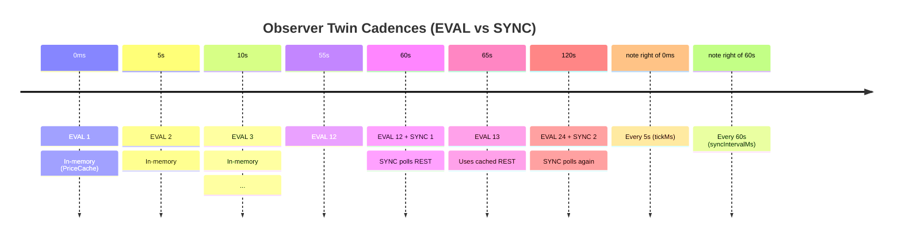

# Observer — Unified Event Scanner

## Overview

The Observer is the **only proactive scanner** in Ghost. It watches positions, orders, and price targets on two cadences and emits typed events for the judge skill to reason about.

**Wired at:** `src/runtime.ts:532-551`  
**Entry:** `src/daemon/jobs/observer.ts`

## Cadence Diagram



- **EVAL (5s default):** Read in-memory snapshot (PriceCache, AlertRulesService) → diff → detect → filter → judge → dispatch. Cheap.
- **SYNC (60s default):** REST poll positions/orders/fills/historical orders → refresh `cachedRest`. Throttled separately.

**Source:** `src/observer/loop.ts:1-30`

## Detector Reference

| Detector | File | Events Emitted | When |
|----------|------|----------------|------|
| **Fills** | `src/observer/detect/fills.ts` | `order_filled`, `tp_hit`, `sl_hit`, `position_liquidated`, `position_closed` | New fill appears in history (REST sync only) |
| **Positions** | `src/observer/detect/positions.ts` | `pnl_snapshot`, `liquidation_risk` | Every tick; liquidation_risk when mark crosses threshold |
| **Price Target** | `src/observer/detect/price-target.ts` | `price_alert` | AlertRulesService rule fires (price crosses) |
| **Canceled Orders** | `src/observer/detect/canceled-orders.ts` | `order_canceled` | Order removed from open set; reason typed (user / margin / liquidation / selfTrade) |
| **Closed Fallback** | `src/observer/detect/closed-fallback.ts` | `position_closed` | Position vanished without fill (REST lag race; fallback only) |

**Source:** `src/observer/events.ts:1-50`

## Filter Gate: When LLM Is Called

**Rule (src/observer/loop.ts:69-86):**

- If ANY non-`pnl_snapshot` event exists → pass to judge (LLM).
- If only `pnl_snapshot` events exist → check open-order set change.
- If open-order set unchanged → **skip LLM** (pnl snapshot becomes context only).

Why? pnl changes every second; structural events (fills, cancels, liquidations) are the ones that warrant a reply.

## Config Keys

Tunable via `~/.ghost/config.json` under `observer.*`:

```json
{
  "observer": {
    "enabled": true,
    "tickMs": 5000,
    "syncIntervalMs": 60000,
    "liquidationProgressThreshold": 0.8
  }
}
```

| Key | Type | Default | Purpose |
|-----|------|---------|---------|
| `enabled` | bool | `true` | Master kill switch. Set `false` to disable all proactive scanning. |
| `tickMs` | int | 5000 | EVAL cadence (ms). Interval between in-memory diffs. |
| `syncIntervalMs` | int | 60000 | SYNC cadence (ms). REST poll throttle. Eval reuses cached snapshot between syncs. |
| `liquidationProgressThreshold` | float | 0.8 | Threshold (0.0–1.0) at which liquidation_risk fires. 0.8 = 80% of entry→liq distance. |

**Source:** `src/config/schema.ts:114-139`

## Troubleshooting

**Too many alerts (noisy)**
- Increase `liquidationProgressThreshold` (e.g., 0.9 = only 10% from liq).
- Increase `tickMs` (e.g., 10000 = scan every 10s instead of 5s).
- Disable rules in AlertRulesService via web or tool.

**Missing events**
- Ensure `observer.enabled: true` in config.
- Check that daemon is running (`ghost daemon stop` returns a pid).
- Verify REST endpoints are reachable (HL API issue).
- For fills: make sure REST sync just fired (wait up to `syncIntervalMs`).

**Rate-limit signals**
- Reduce `syncIntervalMs` (currently 60s; 120s is safer for slow networks).
- Set `gateway.rateLimitRpm` higher if internal tool calls are being throttled.

**Liquidation risk not firing**
- Check `liquidationProgressThreshold` (default 0.8 = 80%).
- Verify mark price is being sourced (PriceCache must have fresh tickers).
- Margin tier may not apply (see `src/services/paper/margin-tiers.ts` for leverage limits).

## Event Payloads

All events include:
- `type`: event kind (typed union).
- `detectedAt`: wall-clock ms when the observer found it.

Per-event fields (e.g., symbol, side, size, pnl, fill id) are self-contained for judge skill use without further round-trips.

**Source:** `src/observer/events.ts:20-157`
