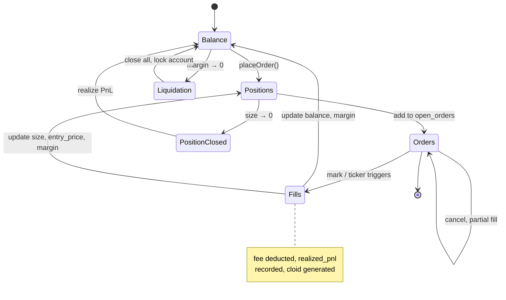

# Paper Trading — Simulation Engine

## Overview

PaperEngine is a persistent SQLite state machine that simulates order fills using live market data. All account state (balances, positions, orders, fills) survives daemon restarts.

**Engine:** `src/services/paper/engine.ts` (759 LOC)  
**Config:** `src/config/schema.ts:91-99`  
**DB path:** `~/.ghost/workspace/paper-trading.db`

Enable with `config.json`:
```json
{ "paper": { "enabled": true, "initialBalance": 10000 } }
```

**Source:** `src/services/paper/client.ts:1-20` (facade that wraps live client with engine)

## State Machine



## Fill Simulation Rules

### Market Orders

- Executed immediately at the current mark price (from live PriceCache).
- Fee deducted at fill time: `fee = size × price × takerFee`.
- Cloid: deterministic SHA-256 of orderId (`src/services/paper/engine.ts:28-31`).

### Limit Orders

- Queued in `paper_orders` table.
- Scanner checks if mark price has crossed the limit price each EVAL tick.
- If crossed: fill at the **limit price** (not mark), then deduct fee.
- Fee: `size × price × makerFee` (assumes filled at rest).

### Slippage Assumption

Paper trading assumes **zero slippage.** The simulator does not model market depth, impact, or partial fills due to insufficient liquidity. Live trading may experience slippage; this is a simplification.

**Source:** `src/services/paper/engine.ts:200-300` (fill simulation logic)

## Margin Tier Table

| Asset | Max Leverage | Maintenance Margin |
|-------|--------------|-------------------|
| BTC   | 40x          | 0.5%              |
| ETH   | 25x          | 1.0%              |
| SOL   | 20x          | 1.5%              |
| DOGE, AVAX, LINK, ARB, OP, SUI, MATIC, APT, INJ, NEAR, ATOM, FTM, TIA | 10x | 2.5% |
| *Others* | 5x | 5.0% |

**Source:** `src/services/paper/margin-tiers.ts:11-32`

## Liquidation Formula

**Maintenance Margin Required:**
```
required = position_margin × maintenance_margin_rate
```

**Liquidation Trigger:**
```
balance < required
```

When triggered:
1. All positions are force-closed at the current mark price.
2. Realized PnL recorded.
3. Account balance locked (no more trades).

**Worked Example:**

- Balance: $10,000
- Position: 1 BTC long @ $50,000, 10x leverage
- Margin used: $5,000 (entry price / leverage)
- Maintenance margin rate (BTC): 0.5%
- Required margin: $5,000 × 0.005 = $25
- Liquidation price: $50,000 × (1 - 0.5%) = $49,750
- If mark drops to $49,750: balance → $25. Force close at $49,750. Loss = $2,500.

**Source:** `src/services/paper/engine.ts:400-450` (liquidation check & close logic)

## Deterministic Cloid

Every paper order receives a stable Ghost-prefix cloid derived from `orderId` via SHA-256:

```typescript
function deterministicGhostCloid(orderId: string): string {
  const hash = createHash("sha256").update(orderId).digest("hex");
  return `${GHOST_CLOID_PREFIX}${hash.slice(0, 22)}`;
}
```

**Why?** Idempotent across reads. `getHistoricalOrders()` called twice returns the same cloid, matching live client behavior. Attribution tools (`isGhostCloid()`) correctly label paper orders as Ghost-placed.

**Source:** `src/services/paper/engine.ts:28-31`

## Reset & Replay Workflow

### Reset Paper State

1. Stop daemon: `ghost daemon stop`
2. Delete the paper DB: `rm ~/.ghost/workspace/paper-trading.db`
3. Restart: `ghost daemon --paper -b 50000` (or your desired balance)

### Replay from History

There is no built-in "replay from date X" feature. If you want to test a sequence of trades:

1. Export fills from `paper_fills` table.
2. Reset the DB.
3. Use the `place_order` tool to re-execute the sequence.

Alternative: take a DB snapshot before a trading session, then restore it to replay.

## Initial Balance & Fee Rates

Via config:

```json
{
  "paper": {
    "initialBalance": 10000,
    "takerFee": 0.00045,
    "makerFee": 0.00015
  }
}
```

| Key | Type | Default | Purpose |
|-----|------|---------|---------|
| `initialBalance` | float | 10000 | Starting USDC balance |
| `takerFee` | float | 0.00045 | Market order fee (0.045%; HL tier 0) |
| `makerFee` | float | 0.00015 | Limit order fee (0.015%; HL tier 0) |

**Source:** `src/config/schema.ts:91-99`

## Database Schema

Tables:
- `paper_accounts` — single-row account state (balance, created_at).
- `paper_positions` — active long/short positions per symbol.
- `paper_orders` — resting limit/stop orders (deleted on fill/cancel).
- `paper_fills` — historical fills (immutable append-only log).

All use WAL journaling for safe concurrent reads during market data updates.

**Source:** `src/services/paper/engine.ts:72-120`
