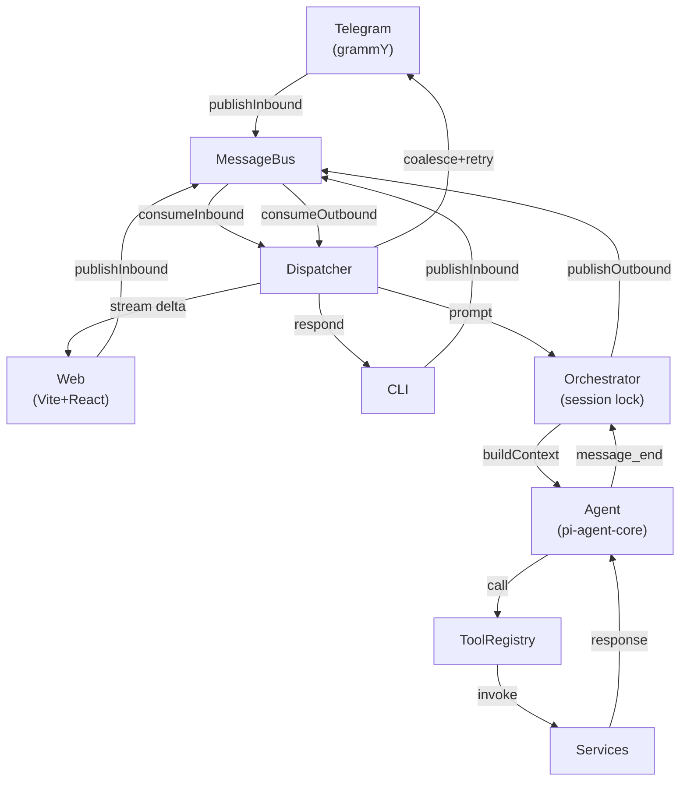
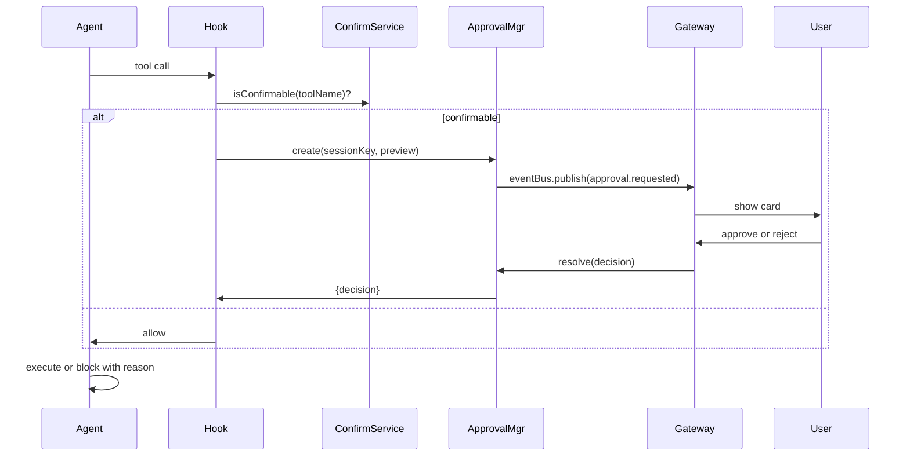

# Architecture Reference

Ghost is a unified runtime: channels (Telegram, web, CLI) → MessageBus → Dispatcher → Orchestrator → pi-agent-core + 56 tools + services.

## System Diagram

**Flow:** Channels publish inbound → Dispatcher gates (semaphore 5), calls Orchestrator → Orchestrator acquires session lock, builds context, calls Agent → Agent streams tool calls through registry → Tools invoke services, return responses → Orchestrator publishes outbound → Dispatcher applies coalescing (non-streaming) and exponential-backoff retry (1, 2, 4 sec).

## Subsystem Inventory

| Subsystem | Path | Purpose |
|-----------|------|---------|
| **Daemon** | `src/daemon/index.ts:136` | 13-step boot: guards, runtime, gateway, channels, background jobs, signal handlers |
| **Runtime** | `src/runtime.ts:206` | Composition root: wires 25+ services, agents, channels in lifecycle order |
| **Orchestrator** | `src/agent/orchestrator.ts:78` | Per-message: session lock, context build, tool refresh, event subscription, persist |
| **Runner** | `src/agent/runner.ts:51` | Background tasks: single-flight chain, clears origin to prevent session bleed |
| **Dispatcher** | `src/channels/dispatcher.ts:76` | Inbound consumer, streaming state machine, outbound retry + coalescing |
| **MessageBus** | `src/bus/queue.ts:7` | 1:1 FIFO (inbound/outbound queues) — channels ↔ orchestrator decoupling |
| **EventBus** | `src/bus/events.ts:15` | 1:N pub/sub (sync) — services → web/Telegram broadcasts |
| **Channels** | `src/channels/manager.ts` | Telegram (grammY), web (WS), CLI; each declares `supportsStreaming` |
| **ToolRegistry** | `src/tools/index.ts` | Generic (9) + trading (47) tools; TypeBox schemas; refreshed per prompt |
| **ContextBuilder** | `src/agent/context-builder.ts` | Factory: SOUL.md + memory + skills + runtime state, built fresh per turn |
| **Config** | `src/config/index.ts` | Zod schema; loaded from `~/.ghost/config.json`; secrets encrypted |
| **Database** | `src/core/database.ts:1` | SQLite WAL baseline; migrations via `src/core/migrations/registry.ts` |
| **Memory** | `src/memory/store.ts` | MEMORY.md + HISTORY.md; consolidation on overflow via taskAgent |
| **Session** | `src/session/manager.ts` | JSONL per chat; load-on-demand |
| **Auth** | `src/auth/oauth.js` | OAuth tokens (Hyperliquid, Twitter, Google, Anthropic) |
| **Gateway** | `src/gateway/server.ts` | ElysiaJS: REST, WebSocket, approval delivery |
| **Trading Client** | `src/services/live/client.ts` | Hyperliquid SDK; wrapped with `PaperTradingClient` if paper mode |
| **Wallet Store** | `src/services/live/wallet-store.ts` | Live: Hyperliquid queries; Paper: in-memory via `IWalletStore` |
| **Intel Service** | `src/services/intel.ts` | Liquidation maps, funding rates, cross-exchange |
| **Watchlist** | `src/services/watchlist.ts` | User tickers; DB-backed |
| **Alert Rules** | `src/services/alert-rules.ts` | Persistent conditions; scanned by observer on each tick |
| **News Service** | `src/services/news.ts` | RSS + discovery; bg job fetches + summarizes |
| **Tweet Service** | `src/services/tweets.ts` | Twitter/X API; bg job fetches followed tweets |
| **TA Indicators** | `src/services/ta-indicators.ts` | EMA, RSI, MACD, Bollinger Bands |
| **TA Levels** | `src/services/ta-levels.ts` | Support/resistance; DB-backed |
| **Chart Series** | `src/services/chart-series.ts` | OHLCV + indicator data for web charts |
| **Whale Tracking** | `src/services/whale-tracking.ts` | Large position monitor |
| **Funding Rates** | `src/services/funding/index.ts` | Multi-exchange (Binance, Bybit, OKX) |
| **Observer** | `src/observer/loop.ts` | Unified proactive loop: scan alert rules + watchlist + positions → judge → dispatch |
| **Security** | `src/security/policy.ts` | Autonomy L0–L3; read vs. write gate; confirmation required |
| **Leak Detector** | `src/security/leak-detector.ts` | Scan outputs for secret patterns |
| **Approval Mgr** | `src/gateway/approval.ts` | Trading approval cards: web UI gate for write ops |
| **Scheduler** | `src/scheduler/service.ts` | Cron service: JSON-backed |
| **Skills** | `src/skills/index.ts` | Loader; syncs DB state with filesystem |

## Boot Sequence (13 Steps)

1. **Guard** (`src/daemon/index.ts:139`): Check running OS service; if active, prompt user (logs, restart, stop, abort)
2. **Create Runtime** (`src/daemon/index.ts:143`): Call `createRuntime()` to wire all subsystems
3. **Boot Guard** (`src/daemon/index.ts:177`): Enforce loopback bind — refuse to start on a non-loopback host
4. **Auth Display** (`src/daemon/index.ts:189`): Determine auth status for banner
5. **Telegram** (`src/daemon/index.ts:202`): Activate if bot token present
6. **Gateway** (`src/daemon/index.ts:223`): Spin up ElysiaJS app + WS + REST
7. **EventBus → Web** (`src/daemon/index.ts:262`): Wire broadcasts; isolate trading approvals by origin
8. **Cron Handler** (`src/daemon/index.ts:267`): Register for scheduled tasks
9. **Start Channels & Scheduler** (`src/daemon/index.ts:279`): Call `channelManager.startAllChannels()` + `cronService.start()`
10. **Start Background Jobs** (`src/daemon/index.ts:287`): Kick news-fetch, tweet-fetch, observer ticks, wallet probe
11. **Await Wallet** (`src/daemon/index.ts:304`): Block until `runtime.walletReady` resolves
12. **Listen** (`src/daemon/index.ts:306`): Call `app.listen()`
13. **Banner + Signals** (`src/daemon/index.ts:309`): Print banner; install SIGINT/SIGTERM handlers

## createRuntime() Lifecycle

| Step | Purpose | File:Line |
|------|---------|-----------|
| 1 | Load + migrate config (Zod) | `src/runtime.ts:208` |
| 2 | Init SQLite WAL + migrations | `src/runtime.ts:231` |
| 3 | Pairing store | `src/runtime.ts:234` |
| 4 | Secret + credential vault | `src/runtime.ts:235` |
| 5 | MessageBus (inbound/outbound) | `src/runtime.ts:240` |
| 6 | Memory + session manager | `src/runtime.ts:243` |
| 7 | Security + leak detector | `src/runtime.ts:247` |
| 8 | OAuth manager | `src/runtime.ts:255` |
| 9 | Skills loader + service | `src/runtime.ts:258` |
| 10 | Context builder | `src/runtime.ts:266` |
| 11 | Tool registry (generic only) | `src/runtime.ts:274` |
| 12 | Trading client (live or paper) | `src/runtime.ts:283` |
| 13 | Wallet store + domain services | `src/runtime.ts:289` |
| 14 | Two agents: `agent` (confirm on), `taskAgent` (confirm off) | `src/runtime.ts:338` |
| 15 | Runner (serializes taskAgent) | `src/runtime.ts:379` |
| 16 | Orchestrator (session lock) | `src/runtime.ts:397` |
| 17 | ConfirmService (late-bound via ref) | `src/runtime.ts:406` |

After step 17: trading tools registered, agent snapshots refreshed, wallet loads async, event/approval/channel infrastructure wired.

## Orchestrator.prompt() — Per-Message (10 Steps)

Entry point `src/agent/orchestrator.ts:78-208`.

1. **Session lock** (`src/orchestrator.ts:79`): `AsyncKeyLock` serializes all prompts for same session
2. **Pre-consolidation** (`src/orchestrator.ts:94`): If memory exceeds budget, consolidate via `consolidator.maybeConsolidate()`
3. **Load history** (`src/orchestrator.ts:90`): Fetch JSONL for this session
4. **Swap context** (`src/orchestrator.ts:99`): Set `agent.state.messages` to history; set `agent.sessionId` to MAIN_SESSION_KEY
5. **Build prompt** (`src/orchestrator.ts:109`): Call `contextBuilder.buildFullPrompt(channel, chatId)` with fresh memory + runtime context
6. **Refresh tools** (`src/orchestrator.ts:113`): `agent.state.tools = tools.all()` (late-registered trading tools visible)
7. **Inject origin** (`src/orchestrator.ts:116`): Set `{channel, chatId}` on OriginAware tools for approval routing
8. **Subscribe events** (`src/orchestrator.ts:128`): Capture `text_delta`, `tool_execution_start/end`, `message_end`
9. **Call agent** (`src/orchestrator.ts:186`): Pi-agent-core runs; hooks: `beforeToolCall` (confirm), `afterToolCall` (leak detect)
10. **Persist** (`src/orchestrator.ts:159`): On `message_end`, append to session JSONL; return `{text, toolCalls[]}`

Post-consolidation (`src/orchestrator.ts:200`): Non-blocking bg consolidation if memory filled.

## Dispatcher Streaming State Machine

Driven by agent events. Pre-tool narration dropped on `tool_execution_end` (buffer cleared). Post-tool text published live (streaming) or buffered (non-streaming).

### Streaming Channel (supportsStreaming = true)

| Trigger | Action |
|---------|--------|
| `text_delta` + !acceptDelta | Buffer (pre-tool narration) |
| `tool_execution_start` | Increment runningToolCount |
| `tool_execution_end` (last) | Clear buffer; set acceptDelta=true |
| `text_delta` (first post-tool) | Set streaming=true; publish delta via `publishStreamDelta()` |
| `text_delta` (live) | Publish immediately |
| `message_end` or stream resolver | Publish `_stream_end` marker |

### Non-Streaming Channel (supportsStreaming = false)

| Trigger | Action |
|---------|--------|
| `text_delta` | Buffer (pre-tool + post-tool) |
| `tool_execution_start` | Increment runningToolCount |
| `tool_execution_end` (last) | Clear buffer; set acceptDelta=true |
| `text_delta` (post-tool) | Buffer (only) |
| `message_end` or stream resolver | Publish coalesced buffer as single message |

**Stream markers:**
- `_stream_delta: true` — Delta chunk in live stream
- `_stream_id: "{sessionKey}:{timestamp}"` — Correlate deltas into one message bubble
- `_stream_end: true` — Final marker; close stream bubble

**Claude CLI** (no `tool_execution_start/end`): On `message_update` with `toolcall_end` type → treat as synthetic tool completion.

## Confirm Flow

Key: `beforeToolCall` hook checks `isConfirmable(toolName)` from `src/services/confirm-policy.ts`. Multi-tool batches show single card with numbered steps. Rejections include optional reason flowing back as synthetic tool result.

## Architectural Choices

| Choice | Why |
|--------|-----|
| **Dual agents** (agent + taskAgent) | `agent`: user prompts, confirm on. `taskAgent`: bg jobs, confirm off (would deadlock). Share tool registry; refresh per prompt. |
| **Late-bound ConfirmService** | Circular dependency break: ConfirmService passed as lazy getter, populated after Orchestrator constructed (`src/runtime.ts:333, 411`). |
| **Session lock at Orchestrator** | Bus queues without blocking. Orchestrator serializes per session via `AsyncKeyLock` → atomic DB writes, prevents concurrent corruption. |
| **ContextBuilder factory** | Fresh memory, runtime context, disabled-skills per turn. Late-registered tools visible in next prompt; no restart needed. |
| **Unified Observer** | Single tick, single judge call, single DB snapshot. No stale data / race conditions between independent loops. |
| **Tools refresh per prompt** | `agent.state.tools = tools.all()` on every Orchestrator.prompt() + Runner.call(). New trading tools immediately visible. |
| **MessageBus no topics** | FIFO simplicity. Channels identified by (channel, chatId) tuple in message envelope. |
| **Streaming is dispatcher concern** | Agent state-agnostic; publishes all deltas. Dispatcher reads `channel.supportsStreaming` → live (streaming) or buffer (non-streaming). |

## Files to Read

1. `src/runtime.ts` (1168 LOC) — Every wire, composition order, hook factories
2. `src/agent/orchestrator.ts` (219 LOC) — Session lock, prompt entry, event persistence
3. `src/agent/runner.ts` (166 LOC) — Background task serialization
4. `src/channels/dispatcher.ts` (321 LOC) — Inbound consumer, streaming state machine, retry
5. `src/bus/queue.ts` + `src/bus/events.ts` — FIFO vs. pub/sub
